# 🛒 Agentic RAG: E-commerce AI Agent with LangGraph & MongoDB

<div align="center">


**Build an intelligent shopping assistant that thinks, acts, and adapts like a human sales associate**

</div>

## 🎯 What We're Building

In this tutorial, we'll create a sophisticated **AI Agent** using an **agentic approach** - not just a chatbot that responds, but an intelligent system that autonomously:

- 🧠 **Thinks**: Analyzes customer queries and decides the best action
- 🔍 **Acts**: Searches real product databases using vector embeddings  
- 🔄 **Adapts**: Falls back to alternative search strategies when needed
- 💭 **Remembers**: Maintains conversation context across interactions

---

## 📚 What You'll Learn

<table>
<tr>
<td width="50%">

### 🏗️ **Core Concepts**
- ✨ **Agentic AI Architecture**
- 🗃️ **MongoDB Atlas Vector Search**
- 🌊 **LangGraph Workflow Orchestration**
- 💬 **Conversational State Management**

</td>
<td width="50%">

### 🛠️ **Practical Skills**
- 🔗 **API Integration** (Google Gemini AI)
- ⚛️ **React 19 Frontend Development**
- 🌐 **TypeScript RESTful API Design**
- 📊 **Database Seeding & Management**

</td>
</tr>
</table>

---

## 👶 New to Programming? Start Here!

**If you're completely new to development**, this section will help you understand what you're looking at:

### 🏗️ **What is this project?**
Think of this like building a smart shopping assistant that can:
- Understand what customers want (like "show me dining tables")
- Search through a store's inventory intelligently
- Have natural conversations with customers
- Remember previous parts of the conversation

### 🔧 **Technologies Explained (with Python comparisons)**

| Technology | What it does | Python equivalent | Why we use it |
|------------|--------------|-------------------|----------------|
| **JavaScript/TypeScript** | Programming language for web | Python | More common for web development |
| **Node.js** | Runs JavaScript on servers | Python interpreter | Lets us use JavaScript on the backend |
| **Express.js** | Web framework | Flask/Django | Creates web APIs easily |
| **React** | Frontend UI library | Streamlit/Dash | Builds interactive web interfaces |
| **MongoDB** | Database | SQLite/PostgreSQL | Stores data with built-in AI search |
| **LangGraph** | AI workflow manager | Custom Python classes | Manages AI decision-making |

### 📂 **Project Structure (Think of it like a house)**
```
agentic-rag/
├── 📁 server/          # Backend (like the kitchen - where the work happens)
│   ├── index.ts        # Main server file (like main.py)
│   ├── agent.ts        # AI brain (like a smart_assistant.py)
│   └── seed-database.ts # Data setup script (like setup_data.py)
│
├── 📁 client/          # Frontend (like the living room - what customers see)
│   ├── App.js          # Main app component (like app.py for Streamlit)
│   └── components/     # UI pieces (like reusable functions)
│
└── README.md           # This instruction manual
```

### 🎯 **How the Code Works (Simple Explanation)**

1. **Customer types a message** → Frontend (React) catches it
2. **Message sent to server** → Backend (Express) receives it
3. **AI agent processes message** → LangGraph decides what to do
4. **Search database if needed** → MongoDB finds relevant products
5. **AI generates response** → Gemini creates human-like reply
6. **Response sent back** → Customer sees the answer

**In Python terms:** It's like a Flask app with an AI chatbot that can search a database and remember conversations.

---

## 🚀 Prerequisites

Before we start, make sure you have:

<table>
<tr>
<td>

**📦 Required Software**
- [Node.js & npm](https://nodejs.org/) (v18+) - *Like installing Python*
- Git - *For downloading code*
- TypeScript (for development) - *Like installing Python packages*

</td>
<td>

**🔑 API Keys Needed**
- [Google AI API Key](https://aistudio.google.com/app/apikey) - *Like OpenAI API key*
- [MongoDB Atlas Account](https://www.mongodb.com/cloud/atlas) - *Like a database service*

</td>
</tr>
</table>

---

## ⚡ Quick Start

### 📥 **Step 1: Install Dependencies**

```bash
# Navigate to the project directory
cd agentic-rag

# Install server dependencies
cd server
npm install

# Install client dependencies
cd ../client
npm install
```

### 🔧 **Step 2: Environment Setup**

Create a `.env` file in the `server` directory:

```env
# 🤖 AI Model APIs
GOOGLE_API_KEY=your_google_api_key_here

# 🗄️ Database
MONGODB_ATLAS_URI=your_mongodb_atlas_uri_here

# 🌐 Server Configuration (optional - defaults to 8000)
PORT=8000
```

### 🌱 **Step 3: Seed the Database**

```bash
# Generate AI-powered synthetic furniture data
npm run seed
```

<details>
<summary>🔍 What happens during seeding?</summary>

- 🤖 **AI generates** 10 realistic furniture items using Google Gemini
- 📝 **Creates searchable summaries** for each item
- 🔢 **Generates vector embeddings** using Google AI
- 💾 **Stores everything** in MongoDB Atlas with vector search indices

</details>

### 🚀 **Step 4: Start the Backend**

```bash
npm run dev
```

Your AI agent is now running on `http://localhost:8000` 🎉

---

## 🧪 Testing Your AI Agent

### 💬 **Start a New Conversation**
```bash
curl -X POST -H "Content-Type: application/json" \
  -d '{"message": "Do you have any dining tables?"}' \
  http://localhost:8000/chat
```

**Response:**
```json
{
  "threadId": "1703123456789",
  "response": "Yes! I found several dining tables in our inventory. Here's what we have available..."
}
```

### 🔄 **Continue the Conversation**
```bash
curl -X POST -H "Content-Type: application/json" \
  -d '{"message": "What about the price range?"}' \
  http://localhost:8000/chat/1703123456789
```

---

## 🎨 Frontend Setup

### 📱 **Step 5: Launch the React App**

```bash
# In a new terminal, navigate to client directory
cd ../client
npm install

# Start the React development server
npm run start
```

Visit `http://localhost:3000` to see your beautiful e-commerce store with integrated AI chat! ✨

---

## 📂 Project Structure

```
agentic-rag/
├── 📁 server/                    # Backend TypeScript application
│   ├── 📄 index.ts              # Express server entry point
│   ├── 📄 agent.ts              # LangGraph AI agent implementation
│   ├── 📄 seed-database.ts      # Database seeding script
│   ├── 📄 package.json          # Server dependencies
│   ├── 📄 tsconfig.json         # TypeScript configuration
│   └── 📄 .env                  # Environment variables (create this)
│
├── 📁 client/                    # Frontend React application
│   ├── 📁 src/
│   │   ├── 📄 App.js            # Main React component
│   │   ├── 📄 index.js          # React entry point
│   │   └── 📁 components/
│   │       ├── 📄 EcommerceStore.js  # Main store layout
│   │       └── 📄 ChatWidget.js      # AI chat interface
│   └── 📄 package.json          # Client dependencies
│
└── 📄 README.md                 # This file
```

## 🏗️ Architecture Overview

```mermaid
graph TD
    A[👤 User Query] --> B[🤖 LangGraph Agent]
    B --> C{🧠 Decision Engine}
    C -->|Search Needed| D[🔍 Vector Search Tool]
    C -->|Direct Response| E[💬 Generate Response]
    D --> F[📊 MongoDB Atlas]
    F --> G[📋 Search Results]
    G --> E
    E --> H[✅ Final Response]
    
    style A fill:#e1f5fe
    style B fill:#f3e5f5
    style C fill:#fff3e0
    style D fill:#e8f5e8
    style F fill:#fff9c4
```

<div align="center">



</div>

---

## 🧠 Technology Stack Explained

### 🔧 **Backend Technologies**

| Technology | Similar To | Purpose | Why We Use It |
|------------|-----------|---------|---------------|
| **TypeScript** | Typed languages | Typed JavaScript | Better error catching, IDE support |
| **Express.js** | Web frameworks | HTTP server framework | Lightweight, fast REST API creation |
| **Node.js** | Runtime environments | JavaScript runtime | Server-side JavaScript execution |
| **MongoDB** | Document databases | NoSQL database | Document store with built-in vector search |
| **LangGraph** | Workflow engines | AI orchestration | State management for AI agents |

### ⚛️ **Frontend Technologies**

| Technology | Description | Purpose |
|------------|-------------|---------|
| **React** | Component-based UI library | Building interactive user interfaces |
| **npm** | Package manager | Manages JavaScript dependencies |
| **Webpack** | Built into React Scripts | Bundles and optimizes code for browsers |

### 🤖 **AI/ML Stack**

| Component | What It Does | Similar Technologies |
|-----------|--------------|---------------------|
| **Google Gemini** | Large Language Model | OpenAI GPT, Claude, other LLMs |
| **Vector Embeddings** | Text → numerical vectors | sentence-transformers, word2vec |
| **Vector Search** | Semantic similarity search | FAISS, Pinecone, Weaviate |
| **RAG Pattern** | Retrieval + Generation | Information retrieval + AI generation |

---

## 🌟 Key Features

<table>
<tr>
<td width="33%">

### 🧠 **Intelligent Decision Making**
- Autonomous tool selection
- Context-aware responses
- Multi-step reasoning

</td>
<td width="33%">

### 🔍 **Advanced Search**
- Vector semantic search
- Text fallback search
- Real-time inventory lookup

</td>
<td width="33%">

### 💬 **Natural Conversations**
- Conversation memory
- Thread-based persistence
- Human-like interactions

</td>
</tr>
</table>

---

## 🛠️ API Endpoints

| Method | Endpoint | Description | Example |
|--------|----------|-------------|---------|
| `GET` | `/` | Health check | Returns server status |
| `POST` | `/chat` | Start new conversation | Returns `threadId` and response |
| `POST` | `/chat/:threadId` | Continue conversation | Returns response with context |

---

## 🎯 What Makes This "Agentic"?

Unlike traditional chatbots, our AI agent:

| 🤖 **Traditional Chatbot** | 🧠 **Our Agentic System** |
|---------------------------|---------------------------|
| Pre-programmed responses | Dynamic decision making |
| Static information | Real-time database queries |
| Single-turn interactions | Multi-step autonomous actions |
| No tool usage | Custom tool integration |
| Can't adapt to failures | Intelligent fallback strategies |

---

## 🔍 Code Walkthrough

### 📡 **Backend (`server/index.ts`)**

This is the main server file that handles HTTP requests - **think of it like a Python Flask/FastAPI app**:

```typescript
// Import the Express web framework (similar to "from flask import Flask" in Python)
import express from "express"

// Create the web server instance (like "app = Flask(__name__)" in Python)
const app = express()

// Define API endpoint for chat requests (like "@app.route('/chat', methods=['POST'])" in Flask)
app.post('/chat', async (req, res) => {
  const message = req.body.message        // Extract message from request (like request.json['message'])
  const response = await callAgent(client, message, threadId)  // Call our AI function
  res.json({ response })                  // Return JSON response (like return jsonify())
})
```

**Python Equivalent:**
```python
from flask import Flask, request, jsonify
app = Flask(__name__)

@app.route('/chat', methods=['POST'])
def chat():
    message = request.json['message']
    response = call_agent(client, message, thread_id)
    return jsonify({"response": response})
```

### 🤖 **AI Agent (`server/agent.ts`)**

This contains the AI agent logic with tools and decision-making - **like a Python class with methods**:

```typescript
// 1. Vector Search Tool for querying the database (like defining a function in Python)
const searchTool = new DynamicTool({
  name: "search_inventory",
  description: "Search furniture inventory",
  func: async (query: string) => {
    // Converts text to vectors and searches MongoDB (like using sentence_transformers + FAISS)
    const results = await vectorSearch.similaritySearch(query, 3)
    return results
  }
})

// 2. LangGraph State Machine for workflow orchestration (like a Python state machine)
const workflow = new StateGraph({
  channels: { messages: [] }              // Like a Python list: messages = []
})
  .addNode("agent", callModel)            // Add processing steps (like class methods)
  .addNode("tools", toolNode)             // Execute tools
  .addEdge("agent", "tools")              // Connect the workflow nodes
```

**Python Equivalent:**
```python
from langchain.tools import Tool

# 1. Create search tool (similar concept)
def search_inventory(query: str):
    """Search furniture inventory using vector similarity"""
    results = vector_search.similarity_search(query, k=3)
    return results

search_tool = Tool(
    name="search_inventory",
    description="Search furniture inventory",
    func=search_inventory
)

# 2. Workflow (like a Python class with methods)
class AgentWorkflow:
    def __init__(self):
        self.messages = []  # Similar to messages: [] in TypeScript

    def call_model(self, state):
        # AI decides what to do
        pass

    def use_tools(self, state):
        # Execute tools
        pass
```

### 🎨 **Frontend (`client/src/components/`)**

React components are reusable UI building blocks - **like Python functions that return HTML**:

```javascript
// A function that returns UI elements (like a Python template function)
const EcommerceStore = () => {
  return (
    <div>
      <header>ShopSmart</header>
      <ChatWidget />  {/* AI chat component - like including another template */}
    </div>
  )
}
```

**Python Equivalent (using Jinja2 templates):**
```python
from flask import render_template

def ecommerce_store():
    """Render the main store page"""
    return render_template('ecommerce_store.html',
                         title="ShopSmart",
                         include_chat_widget=True)
```

### 🌱 **Database Seeding (`server/seed-database.ts`)**

A script to populate your database with test data - **like a Python script to seed your database**:

```typescript
// Generate synthetic data using AI (like calling OpenAI API in Python)
const furniture = await llm.invoke("Generate furniture data...")

// Convert text descriptions to vector embeddings (like using sentence-transformers)
const embeddings = await embedder.embedDocuments([description])

// Store in MongoDB database (like using pymongo)
await collection.insertMany(items)
```

**Python Equivalent:**
```python
import openai
from sentence_transformers import SentenceTransformer
from pymongo import MongoClient

# Generate synthetic data using AI
response = openai.ChatCompletion.create(
    model="gpt-3.5-turbo",
    messages=[{"role": "user", "content": "Generate furniture data..."}]
)
furniture = response.choices[0].message.content

# Convert text to vector embeddings
model = SentenceTransformer('all-MiniLM-L6-v2')
embeddings = model.encode([description])

# Store in MongoDB database
client = MongoClient('mongodb://localhost:27017/')
collection = client.inventory_database.items
collection.insert_many(items)
```

---

## 💡 Key Concepts for Beginners

### 🔄 **Async/Await (Handling slow operations)**
When code needs to wait for something (like calling an API), we use `async/await`:

```typescript
// JavaScript async/await (same syntax as Python!)
async function getData() {
  const result = await fetch('/api/data')  // Wait for API call to finish
  return result.json()                     // Then process the result
}
```

**Python equivalent:**
```python
import asyncio
import aiohttp

async def get_data():
    async with aiohttp.ClientSession() as session:
        async with session.get('/api/data') as response:
            return await response.json()
```

**Why we need this:** API calls and database operations take time. Instead of freezing the app, we tell it to wait patiently.

### 📦 **Package Management (Installing libraries)**
```bash
# npm is like pip for Python
npm install express        # pip install flask
npm run dev               # python app.py
npm test                  # python -m pytest
```

**Think of it like:**
- `npm install` = downloading a tool from the toolbox
- `npm run dev` = starting your development server
- `package.json` = like `requirements.txt` in Python

### 🗃️ **Environment Variables (Keeping secrets safe)**
```typescript
// Same syntax as os.environ in Python
const apiKey = process.env.GOOGLE_API_KEY
```

**Python equivalent:**
```python
import os
api_key = os.environ['GOOGLE_API_KEY']
```

**Why we use this:** API keys and passwords shouldn't be in your code. Environment variables keep them secret and safe.

### 🔗 **API Endpoints (How frontend talks to backend)**
```typescript
// POST /chat - like sending a letter to a specific address
app.post('/chat', (req, res) => {
  const userMessage = req.body.message    // Read the message
  const response = processMessage(userMessage)  // Process it
  res.json({ response })                  // Send back the answer
})
```

**Python Flask equivalent:**
```python
@app.route('/chat', methods=['POST'])
def chat():
    user_message = request.json['message']
    response = process_message(user_message)
    return jsonify({"response": response})
```

### 🧠 **State Management (Remembering things)**
```javascript
// React useState - like a variable that triggers UI updates
const [messages, setMessages] = useState([])  // Empty list initially
setMessages([...messages, newMessage])        // Add new message to list
```

**Python equivalent (conceptually):**
```python
class ChatWidget:
    def __init__(self):
        self.messages = []  # Initialize empty list

    def add_message(self, new_message):
        self.messages.append(new_message)  # Add to list
        self.update_ui()  # Refresh the display
```

---

## 🚀 Development Commands

### 🔧 **Server Commands**
```bash
cd server
npm run dev        # Start development server (like python app.py)
npm run seed       # Populate database with test data
```

### 🎨 **Client Commands**
```bash
cd client
npm start          # Start React development server
npm run build      # Build for production (like webpack)
npm test           # Run tests
```

---

## 🐛 Troubleshooting for Beginners

### 🆘 **Common Issues and Solutions**

| Issue | What it looks like | Python equivalent | How to fix |
|-------|-------------------|-------------------|------------|
| **Port conflicts** | `Error: Port 8000 already in use` | Another Flask app running | Kill other process: `lsof -ti:8000 \| xargs kill -9` or change PORT in .env |
| **Dependencies missing** | `Module not found: express` | `ModuleNotFoundError: No module named 'flask'` | Run `npm install` in both server/ and client/ directories |
| **API key errors** | `401 Unauthorized` or `API key invalid` | Invalid OpenAI API key | Check .env file exists and has correct GOOGLE_API_KEY |
| **Database connection** | `MongoServerError: connection failed` | `pymongo.errors.ServerSelectionTimeoutError` | Verify MONGODB_ATLAS_URI in .env is correct |
| **TypeScript errors** | `Property does not exist on type` | Type hints mismatch | Run `npm run build` to see detailed errors |

### 🔧 **Step-by-Step Debugging**

**Problem: Server won't start**
```bash
# 1. Check if you're in the right directory
pwd  # Should show .../agentic-rag/server

# 2. Check if dependencies are installed
ls node_modules  # Should show many folders

# 3. If not, install them
npm install

# 4. Check environment file exists
ls -la .env  # Should show the .env file

# 5. Try starting again
npm run dev
```

**Problem: Frontend won't connect to backend**
```bash
# 1. Check backend is running (should see "Server running on port 8000")
curl http://localhost:8000/

# 2. Check frontend is trying to connect to right URL
# Look in ChatWidget.js for "http://localhost:8000"

# 3. Check for CORS errors in browser console
# Open browser dev tools (F12) and look for red errors
```

**Problem: AI responses are weird**
```bash
# 1. Check if database has data
# In MongoDB Atlas dashboard, check if "items" collection has documents

# 2. Re-seed the database
npm run seed

# 3. Check API key is working
# Test at https://aistudio.google.com/app/apikey
```

### 🏥 **Emergency Fixes**

**"Nothing works!" - Nuclear option:**
```bash
# 1. Delete all dependencies and reinstall
rm -rf server/node_modules client/node_modules
cd server && npm install
cd ../client && npm install

# 2. Clear the database and reseed
# Delete all data in MongoDB Atlas dashboard
cd ../server && npm run seed

# 3. Start fresh
npm run dev  # In server directory
npm start    # In client directory (new terminal)
```

**"I'm getting permission errors":**
```bash
# Fix npm permissions (Mac/Linux)
sudo chown -R $(whoami) ~/.npm

# Or use nvm to manage Node.js versions
curl -o- https://raw.githubusercontent.com/nvm-sh/nvm/v0.39.0/install.sh | bash
nvm install node
```

---

## 📜 License

This project is licensed under the MIT License.
